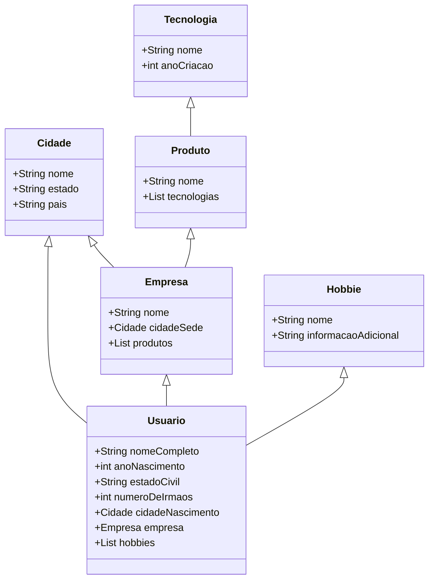

# GraphQL na vida real

## Introdução 
Primeira mente deixa eu me apresentar. 
Muito prazer eu sou o **_Luiz Leite Oliveira_**, nasci em **_1991_** na cidade de **_Belo Horizonte_**, meu estado civil **_casado_**, tenho **_2 irmãos_**, atualmente trabalho como **_desenvolvedor_** em 
uma empresa de **_Belo Horizonte_** chamada **_Hotmart_**, que tem um site hospedado em [Hotmart](https://hotmart.com). A Hotmart tem vários produtos como uma 
**_plataforma de afiliados_** construída por **_micro serviços_** com **_back-end_**, usando tecnologias como **_Kotlin_** e **_Java_** e **_front-end_** em **_Javascript_**, uma **_área de membros_**
com as mesmas tecnologias, e um aplicativo de entrega de conteúdo que tem **_back-end_** em **_Java_** e o app em **_Kotlin_** e **_Swift_**. Se você chegou
até aqui eu prometo que já to terminando e isso tem um propósito. Para completar eu queria falar que eu amo **_jogos_** como **_Counter Strike_** em que eu tenho nível **_Prata 1_**, jogo também **_Fortnite_** tenho **_8_** guarda chuvas de temporada, 
e no **_FIFA_** já fui top **_50K_** mundial. Como esporte eu pratiquei **_natação_**.

Se chegou até aqui vai começar a ficar interessante eu não tinha interesse nenhum que esse post fosse sobre quem sou eu, mas bem provável que nesse primeiro parágrafo
alguns ficaram interessados por algumas partes e outras nem tanto. Exemplo: Pode ser que caso você é um back-end de Belo Horizonte se importou mais com a parte que eu 
citei as tecnologias que são utilizadas em nossos micro serviços. Agora se você é meu irmão você achou muito legal eu citei a minha familia e o resto nesse ponto já nem sabe
mais o que eu to falando.

## Beleza... legal... e aí? 

Tranquilo vamos imaginar que isso tudo fosse separado em micro serviços como seria? Podemos imaginar alguma coisa da seguinte forma:

[![](https://mermaid.ink/img/eyJjb2RlIjoiY2xhc3NEaWFncmFtXG5cdENpZGFkZSA8fC0tIFVzdWFyaW9cblx0Q2lkYWRlIDx8LS0gRW1wcmVzYVxuXHRFbXByZXNhIDx8LS0gVXN1YXJpb1xuICBQcm9kdXRvIDx8LS0gRW1wcmVzYVxuICBUZWNub2xvZ2lhIDx8LS0gUHJvZHV0b1xuICBIb2JiaWUgPHwtLSBVc3VhcmlvXG5cblx0Y2xhc3MgVXN1YXJpb3tcblx0XHQrU3RyaW5nIG5vbWVDb21wbGV0b1xuXHRcdCtpbnQgYW5vTmFzY2ltZW50b1xuICAgICtTdHJpbmcgZXN0YWRvQ2l2aWxcbiAgICAraW50IG51bWVyb0RlSXJtYW9zICBcbiAgICArQ2lkYWRlIGNpZGFkZU5hc2NpbWVudG8gIFxuICAgICtFbXByZXNhIGVtcHJlc2FcbiAgICArTGlzdDxIb2JiaWU-IGhvYmJpZXNcblx0fVxuXG4gIGNsYXNzIENpZGFkZSB7XG4gICAgK1N0cmluZyBub21lXG4gICAgK1N0cmluZyBlc3RhZG9cbiAgICArU3RyaW5nIHBhaXNcbiAgfVxuXG5cdGNsYXNzIEVtcHJlc2F7XG5cdFx0K1N0cmluZyBub21lXG4gICAgK0NpZGFkZSBjaWRhZGVTZWRlXG4gICAgK0xpc3Q8UHJvZHV0bz4gcHJvZHV0b3MgICAgXG5cdH1cbiAgXG4gIGNsYXNzIFRlY25vbG9naWF7XG4gICAgK1N0cmluZyBub21lXG4gICAgK2ludCBhbm9DcmlhY2FvXG4gIH1cblxuICBjbGFzcyBQcm9kdXRvIHtcbiAgICArU3RyaW5nIG5vbWVcbiAgICArTGlzdDxUZWNub2xvZ2lhcz4gdGVjbm9sb2dpYXNcbiAgfVxuXG4gIGNsYXNzIEhvYmJpZSB7XG4gICAgK1N0cmluZyBub21lXG4gICAgK1N0cmluZyBpbmZvcm1hY2FvQWRpY2lvbmFsXG4gIH1cblx0XHRcdFx0XHQiLCJtZXJtYWlkIjp7InRoZW1lIjoiZGVmYXVsdCJ9LCJ1cGRhdGVFZGl0b3IiOmZhbHNlfQ)](https://mermaid-js.github.io/mermaid-live-editor/#/edit/eyJjb2RlIjoiY2xhc3NEaWFncmFtXG5cdENpZGFkZSA8fC0tIFVzdWFyaW9cblx0Q2lkYWRlIDx8LS0gRW1wcmVzYVxuXHRFbXByZXNhIDx8LS0gVXN1YXJpb1xuICBQcm9kdXRvIDx8LS0gRW1wcmVzYVxuICBUZWNub2xvZ2lhIDx8LS0gUHJvZHV0b1xuICBIb2JiaWUgPHwtLSBVc3VhcmlvXG5cblx0Y2xhc3MgVXN1YXJpb3tcblx0XHQrU3RyaW5nIG5vbWVDb21wbGV0b1xuXHRcdCtpbnQgYW5vTmFzY2ltZW50b1xuICAgICtTdHJpbmcgZXN0YWRvQ2l2aWxcbiAgICAraW50IG51bWVyb0RlSXJtYW9zICBcbiAgICArQ2lkYWRlIGNpZGFkZU5hc2NpbWVudG8gIFxuICAgICtFbXByZXNhIGVtcHJlc2FcbiAgICArTGlzdDxIb2JiaWU-IGhvYmJpZXNcblx0fVxuXG4gIGNsYXNzIENpZGFkZSB7XG4gICAgK1N0cmluZyBub21lXG4gICAgK1N0cmluZyBlc3RhZG9cbiAgICArU3RyaW5nIHBhaXNcbiAgfVxuXG5cdGNsYXNzIEVtcHJlc2F7XG5cdFx0K1N0cmluZyBub21lXG4gICAgK0NpZGFkZSBjaWRhZGVTZWRlXG4gICAgK0xpc3Q8UHJvZHV0bz4gcHJvZHV0b3MgICAgXG5cdH1cbiAgXG4gIGNsYXNzIFRlY25vbG9naWF7XG4gICAgK1N0cmluZyBub21lXG4gICAgK2ludCBhbm9DcmlhY2FvXG4gIH1cblxuICBjbGFzcyBQcm9kdXRvIHtcbiAgICArU3RyaW5nIG5vbWVcbiAgICArTGlzdDxUZWNub2xvZ2lhcz4gdGVjbm9sb2dpYXNcbiAgfVxuXG4gIGNsYXNzIEhvYmJpZSB7XG4gICAgK1N0cmluZyBub21lXG4gICAgK1N0cmluZyBpbmZvcm1hY2FvQWRpY2lvbmFsXG4gIH1cblx0XHRcdFx0XHQiLCJtZXJtYWlkIjp7InRoZW1lIjoiZGVmYXVsdCJ9LCJ1cGRhdGVFZGl0b3IiOmZhbHNlfQ)

Agora vamos imaginar que cada quadrado desse por mais absurdo que seja, virou um micro serviço seriam 6 no total, com a ajuda do incrivel [Beeceptor](https://beeceptor.com/)
eu criei estes endpoints mockados para responder sobre exatamente o primeiro paragrafo 

## _Quer acompanhar um pouco mais?_ 

 Me siga nas plataformas.

GitHub: [luizleite-hotmart](https://github.com/luizleite-hotmart)

Twitter: luizleite_

Twitch: [coffee_and_code](https://www.twitch.tv/coffee_and_code)

Linkedin: [luizleiteoliveira](https://www.linkedin.com/in/luizleiteoliveira/)

dev.to: [luizleite_](https://dev.to/luizleite_)