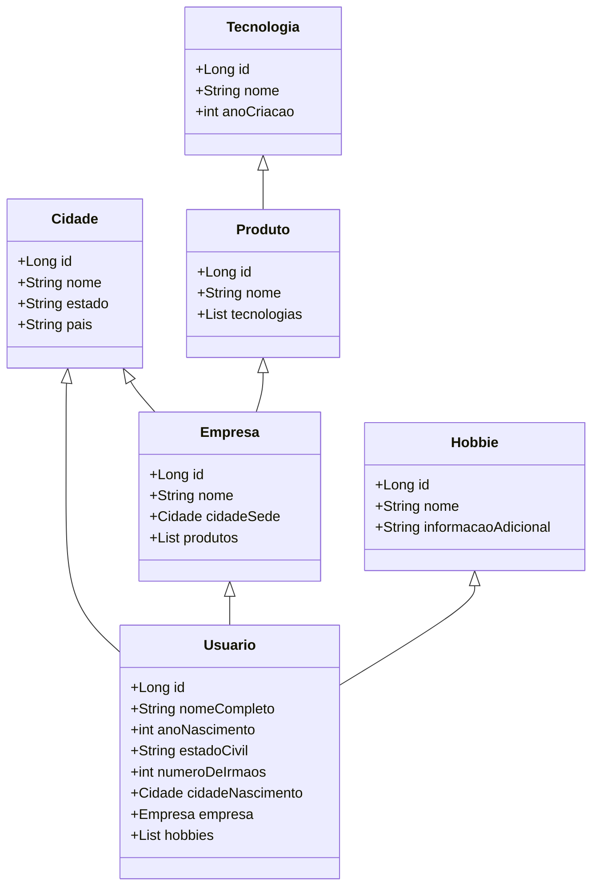

# GraphQL na vida real

## Introdução 
Primeira mente deixa eu me apresentar. 
Muito prazer eu sou o **_Luiz Leite Oliveira_**, nasci em **_1991_** na cidade de **_Belo Horizonte_**, meu estado civil **_casado_**, tenho **_2 irmãos_**, atualmente trabalho como **_desenvolvedor_** em 
uma empresa de **_Belo Horizonte_** chamada **_Hotmart_**, que tem um site hospedado em [Hotmart](https://hotmart.com). A Hotmart tem vários produtos como uma 
**_plataforma de afiliados_** construída por **_micro serviços_** com **_back-end_**, usando tecnologias como **_Kotlin_** e **_Java_** e **_front-end_** em **_Javascript_**, uma **_área de membros_**
com as mesmas tecnologias, e um aplicativo de entrega de conteúdo que tem **_back-end_** em **_Java_** e o app em **_Kotlin_** e **_Swift_**. Se você chegou
até aqui eu prometo que já to terminando e isso tem um propósito. Para completar eu queria falar que eu amo **_jogos_** como **_Counter Strike_** em que eu tenho nível **_Prata 1_**, jogo também **_Fortnite_** tenho **_8_** guarda chuvas de temporada, 
e no **_FIFA_** já fui top **_50K_** mundial. Como esporte eu pratiquei **_natação_**.

Se chegou até aqui vai começar a ficar interessante eu não tinha interesse nenhum que esse post fosse sobre quem sou eu, mas bem provável que nesse primeiro parágrafo
alguns ficaram interessados por algumas partes e outras nem tanto. Exemplo: Pode ser que caso você é um back-end de Belo Horizonte se importou mais com a parte que eu 
citei as tecnologias que são utilizadas em nossos micro serviços. Agora se você é meu irmão você achou muito legal eu citei a minha familia e o resto nesse ponto já nem sabe
mais o que eu to falando.

## Beleza... legal... e aí? 

Tranquilo vamos imaginar que isso tudo fosse separado em micro serviços como seria? Podemos imaginar alguma coisa da seguinte forma:

[![](https://mermaid.ink/img/eyJjb2RlIjoiY2xhc3NEaWFncmFtXG5cdENpZGFkZSA8fC0tIFVzdWFyaW9cblx0Q2lkYWRlIDx8LS0gRW1wcmVzYVxuXHRFbXByZXNhIDx8LS0gVXN1YXJpb1xuICBQcm9kdXRvIDx8LS0gRW1wcmVzYVxuICBUZWNub2xvZ2lhIDx8LS0gUHJvZHV0b1xuICBIb2JiaWUgPHwtLSBVc3VhcmlvXG5cblx0Y2xhc3MgVXN1YXJpb3tcbiAgICArTG9uZyBpZFxuXHRcdCtTdHJpbmcgbm9tZUNvbXBsZXRvXG5cdFx0K2ludCBhbm9OYXNjaW1lbnRvXG4gICAgK1N0cmluZyBlc3RhZG9DaXZpbFxuICAgICtpbnQgbnVtZXJvRGVJcm1hb3MgIFxuICAgICtDaWRhZGUgY2lkYWRlTmFzY2ltZW50byAgXG4gICAgK0VtcHJlc2EgZW1wcmVzYVxuICAgICtMaXN0PEhvYmJpZT4gaG9iYmllc1xuXHR9XG5cbiAgY2xhc3MgQ2lkYWRlIHtcbiAgICArTG9uZyBpZFxuICAgICtTdHJpbmcgbm9tZVxuICAgICtTdHJpbmcgZXN0YWRvXG4gICAgK1N0cmluZyBwYWlzXG4gIH1cblxuXHRjbGFzcyBFbXByZXNhe1xuICAgICtMb25nIGlkXG5cdFx0K1N0cmluZyBub21lXG4gICAgK0NpZGFkZSBjaWRhZGVTZWRlXG4gICAgK0xpc3Q8UHJvZHV0bz4gcHJvZHV0b3MgICAgXG5cdH1cbiAgXG4gIGNsYXNzIFRlY25vbG9naWF7XG4gICAgK0xvbmcgaWRcbiAgICArU3RyaW5nIG5vbWVcbiAgICAraW50IGFub0NyaWFjYW9cbiAgfVxuXG4gIGNsYXNzIFByb2R1dG8ge1xuICAgICtMb25nIGlkXG4gICAgK1N0cmluZyBub21lXG4gICAgK0xpc3Q8VGVjbm9sb2dpYXM-IHRlY25vbG9naWFzXG4gIH1cblxuICBjbGFzcyBIb2JiaWUge1xuICAgICtMb25nIGlkXG4gICAgK1N0cmluZyBub21lXG4gICAgK1N0cmluZyBpbmZvcm1hY2FvQWRpY2lvbmFsXG4gIH1cblx0XHRcdFx0XHQiLCJtZXJtYWlkIjp7InRoZW1lIjoiZGVmYXVsdCJ9LCJ1cGRhdGVFZGl0b3IiOmZhbHNlfQ)](https://mermaid-js.github.io/mermaid-live-editor/#/edit/eyJjb2RlIjoiY2xhc3NEaWFncmFtXG5cdENpZGFkZSA8fC0tIFVzdWFyaW9cblx0Q2lkYWRlIDx8LS0gRW1wcmVzYVxuXHRFbXByZXNhIDx8LS0gVXN1YXJpb1xuICBQcm9kdXRvIDx8LS0gRW1wcmVzYVxuICBUZWNub2xvZ2lhIDx8LS0gUHJvZHV0b1xuICBIb2JiaWUgPHwtLSBVc3VhcmlvXG5cblx0Y2xhc3MgVXN1YXJpb3tcbiAgICArTG9uZyBpZFxuXHRcdCtTdHJpbmcgbm9tZUNvbXBsZXRvXG5cdFx0K2ludCBhbm9OYXNjaW1lbnRvXG4gICAgK1N0cmluZyBlc3RhZG9DaXZpbFxuICAgICtpbnQgbnVtZXJvRGVJcm1hb3MgIFxuICAgICtDaWRhZGUgY2lkYWRlTmFzY2ltZW50byAgXG4gICAgK0VtcHJlc2EgZW1wcmVzYVxuICAgICtMaXN0PEhvYmJpZT4gaG9iYmllc1xuXHR9XG5cbiAgY2xhc3MgQ2lkYWRlIHtcbiAgICArTG9uZyBpZFxuICAgICtTdHJpbmcgbm9tZVxuICAgICtTdHJpbmcgZXN0YWRvXG4gICAgK1N0cmluZyBwYWlzXG4gIH1cblxuXHRjbGFzcyBFbXByZXNhe1xuICAgICtMb25nIGlkXG5cdFx0K1N0cmluZyBub21lXG4gICAgK0NpZGFkZSBjaWRhZGVTZWRlXG4gICAgK0xpc3Q8UHJvZHV0bz4gcHJvZHV0b3MgICAgXG5cdH1cbiAgXG4gIGNsYXNzIFRlY25vbG9naWF7XG4gICAgK0xvbmcgaWRcbiAgICArU3RyaW5nIG5vbWVcbiAgICAraW50IGFub0NyaWFjYW9cbiAgfVxuXG4gIGNsYXNzIFByb2R1dG8ge1xuICAgICtMb25nIGlkXG4gICAgK1N0cmluZyBub21lXG4gICAgK0xpc3Q8VGVjbm9sb2dpYXM-IHRlY25vbG9naWFzXG4gIH1cblxuICBjbGFzcyBIb2JiaWUge1xuICAgICtMb25nIGlkXG4gICAgK1N0cmluZyBub21lXG4gICAgK1N0cmluZyBpbmZvcm1hY2FvQWRpY2lvbmFsXG4gIH1cblx0XHRcdFx0XHQiLCJtZXJtYWlkIjp7InRoZW1lIjoiZGVmYXVsdCJ9LCJ1cGRhdGVFZGl0b3IiOmZhbHNlfQ)



Agora vamos imaginar que cada quadrado desse por mais absurdo que seja, virou um micro serviço seriam 6 no total, com a ajuda do incrível [Beeceptor](https://beeceptor.com/)
eu criei estes endpoints mockados para responder sobre exatamente o primeiro paragrafo.

#### Usuário: 
Chamada `https://luizgraphqluser.free.beeceptor.com/users/1` que tem como retorno:

```json
{
  "id": "1",
  "nomeCompleto": "luiz leite oliveira",
  "anoNascimento": 1991,
  "estadoCivil": "casado",
  "numeroDeIrmaos": 2,
  "cidadeNascimento": 1,
  "empresa": 1,
  "hobbies" : [1,2,3]
}
``` 

#### Hobbie
Chamadas com seus respectivos retornos:

`https://luizgraphqluser.free.beeceptor.com/hobbies/1`

```json
{
  "id": "1",
  "nome": "Counter-Strike",
  "informacaoAdicional": "Prata 1"
}
```

`https://luizgraphqluser.free.beeceptor.com/hobbies/2`

```json
{
  "id": "2",
  "nome": "Fortnite",
  "informacaoAdicional": "8 guarda chuvas"
}
```

`https://luizgraphqluser.free.beeceptor.com/hobbies/3`

```json
{
  "id": "3",
  "nome": "Natação",
  "informacaoAdicional": "nada de mais"
}
```

#### Empresas

`https://luizgraphqluser.free.beeceptor.com/companies/1`

```json
{
  "id": "1",
  "nome": "Hotmart",
  "cidadeSede": 1,
  "produtos": [1,2,3]
}
```

#### Produtos

`https://luizgraphqluser.free.beeceptor.com/products/1`

```json
{
  "id": "1",
  "nome": "plataforma de afiliados",
  "tecnologias": [1,2,3]
}
```


`https://luizgraphqluser.free.beeceptor.com/products/2`

```json
{
  "id": "2",
  "nome": "area de membros",
  "tecnologias": [1,3]
}
```

`https://luizgraphqluser.free.beeceptor.com/products/3`

```json
{
  "id": "3",
  "nome": "app de entrega de conteudo",
  "tecnologias": [1,3, 4]
}
```

#### Tecnologias

`https://luizgraphqluser.free.beeceptor.com/technologies/1`

```json
{
  "id": "1",
  "nome": "Java",
  "anoCriacao": 10  
}
```

`https://luizgraphqluser.free.beeceptor.com/technologies/2`

```json
{
  "id": "2",
  "nome": "Kotlin",
  "anoCriacao": 2013  
}
```

`https://luizgraphqluser.free.beeceptor.com/technologies/3`

```json
{
  "id": "3",
  "nome": "Javascript",
  "anoCriacao": 2002  
}
```
`https://luizgraphqluser.free.beeceptor.com/technologies/4`

```json
{
  "id": "4",
  "nome": "Swift",
  "anoCriacao": 2005  
}
```


## _Quer acompanhar um pouco mais?_ 

 Me siga nas plataformas.

GitHub: [luizleite-hotmart](https://github.com/luizleite-hotmart)

Twitter: luizleite_

Twitch: [coffee_and_code](https://www.twitch.tv/coffee_and_code)

Linkedin: [luizleiteoliveira](https://www.linkedin.com/in/luizleiteoliveira/)

dev.to: [luizleite_](https://dev.to/luizleite_)